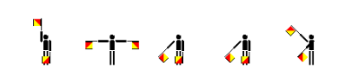

Wat we al weten:


In de cirkels staan er symbolen die overeenkomen met semafoor vlaggen.
Als je die vertaalt krijg je de tekst `draai`


Als je de tekst op de cirkels naar semafoorvlaggen omzet krijg je je:


```
hmwqkyzx
otdtluzn
e#rl#wno
emiukqhu
eesldgal
```


als je ceasar rotations doet hierop, en H doordraait to K krijg je
KPZTNBCA
bij 2 schijf als je de D doordraait tot Z krijg je
KPZPHQVJ


Beide beginnen met KPZ.

Maar wat hier verder mee te doen is onduidelijk.
(HMW en OTD staan even ver van elkaar in het alfabeth, de rest niet)

de andere zijn minder duidelijk
K#XR#CTU ??

KSOAQWNA YGCOEKBO
JJXQILFQ ZZNGYBVG

